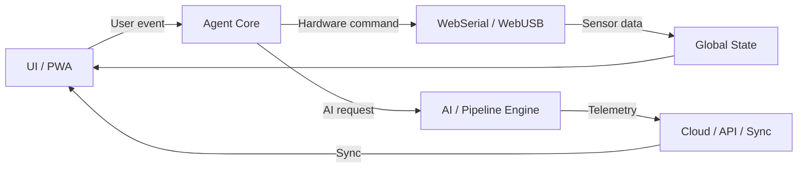

# Arquitectura del sistema GoPilot iAgnt

## Principios de diseño
- Arquitectura modular y hexagonal.
- Separación entre UI, agentes, drivers y servicios.
- Interfaces claras para el hardware y los pipelines IA.
- Capa de estado desacoplada del rendering y de la infraestructura.

## Capas principales
1. **Presentation** (`src/ui`, `src/components`, `src/hooks`)
2. **Domain / Agents** (`src/agents`, `src/workflows`)
3. **Infrastructure** (`src/drivers`, `src/services`)
4. **Persistence / State** (`src/store`)

## Diagrama general

## Flujos clave

### Flujo del agente
1. El usuario emite un comando desde la PWA.
2. `src/agents/core.ts` valida la intención con Zod.
3. El agente enruta la tarea a hardware, IA o simulación.
4. El estado se actualiza en `src/store/state.ts`.

### Flujo WebSerial
1. `src/drivers/webserial/manager.ts` solicita permiso y abre el puerto.
2. Los comandos se serializan y se envían al dispositivo.
3. Los datos de telemetría se parsean y suben al estado.

### Flujo WebUSB
1. `src/drivers/webusb/manager.ts` enumera dispositivos USB.
2. Se establecen endpoints y se reclaman interfaces.
3. Los paquetes se normalizan y se entregan al agente.

### Flujo de pipelines IA
1. La capa de agentes construye un pipeline de pasos.
2. `src/services/api.ts` orquesta llamadas a servicios IA y cloud.
3. El resultado se valida con Zod y se persiste.

### Flujo de sincronización cloud
1. El servicio cloud sincroniza telemetría y estado.
2. El estado local se mantiene con `zustand`.
3. La UI consume la fuente de la verdad centralizada.
